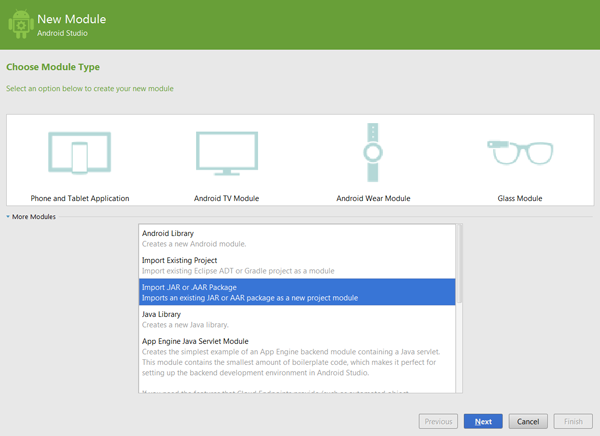

# InsiteoSDK

Insiteo is a provider of indoor location based services such as Map rendering, Location, Itinerary and Geofencing. For further integration documentation you can have a look at the developer's site: <a href="http://dev.insiteo.com/api" target="_blank">http://dev.insiteo.com/api</a>.

This sample application will demonstrate how to take full advantage of those services and integrate them in your application.

For further integration documentation you can have a look at the developer's site: http://dev.insiteo.com/api

If you wish to evaluate indoor location in your own building, you can order our test pack including 8 BLE beacons here:
http://www.insiteo.com/joomla/index.php/en/contact-us.

If you want more information on our services http://www.insiteo.com/joomla/index.php

## Installation

> **IDE integration**
This new release now fully support Gradle build system and is therefore fully compatible with Android Studio. Nevertheless if you want to use the output <code>.aar</code> file in Eclipse ADT this link will explain you the process to follow [Consuming AARs from Eclipse](http://commonsware.com/blog/2014/07/03/consuming-aars-eclipse.html).
 
### Project setup
 
Insiteo's API is provided as a single Android ARchive (<code>.aar</code>) file. In Android Studio you can easily import this archive by right clicking on your _project -> new -> module and select 'Import JAR or AAR Package'_. Make sure to add the module dependency afterward.
 
 
 
 
 
### Requirements

The Insiteo library will require a set of permissions access, they are the following:

```xml
 <uses-permission android:name="android.permission.INTERNET" />
 <uses-permission android:name="android.permission.WRITE_EXTERNAL_STORAGE" />

 <!-- Used to check internet access-->
 <uses-permission android:name="android.permission.ACCESS_NETWORK_STATE" />

 <!-- Used to keep the location service running when app is in the background -->
 <uses-permission android:name="android.permission.WAKE_LOCK" />

 <!-- Used for WIFI type location -->
 <uses-permission android:name="android.permission.ACCESS_WIFI_STATE" />
 <uses-permission android:name="android.permission.CHANGE_WIFI_STATE" />

 <!-- Used for BLE type location -->
 <uses-permission android:name="android.permission.BLUETOOTH" />
 <uses-permission android:name="android.permission.BLUETOOTH_ADMIN" />

 <!-- Required for GPS access -->
 <uses-permission android:name="android.permission.ACCESS_FINE_LOCATION" />

 <!--required to start the beacon service on boot -->
 <uses-permission android:name="android.permission.RECEIVE_BOOT_COMPLETED" />
```

If are using Android Studio (and haven't disable Manifest Merger) those permissions will be automatically merged to yours at build time. If you do not fall into this case then you will have to manually add them to your `AndroidManifest.xml` along with those additional declarations: 

```xml
<receiver android:name=".beacon.service.ISBeaconServiceReceiver" >
   <intent-filter>
      <action android:name="android.intent.action.BOOT_COMPLETED" />
      <action android:name="android.intent.action.ACTION_POWER_CONNECTED" />
      <action android:name="android.intent.action.ACTION_POWER_DISCONNECTED" />
   </intent-filter>
</receiver>

<service
   android:name=".beacon.service.ISBeaconService"
   android:enabled="true"
   android:exported="false"
   android:label="ISBeaconService"
   android:process=":ISBeaconServiceProcess">
</service>
 
<service android:name=".beacon.BeaconIntentProcessor" android:enabled="true" />
<service android:name=".location.ISLocationService" />
```

> **Supported architecture and OS**
Our library is compatible from Android API 15 (ie Android 4.0.3) and up to recent one and supports the following architecture: armeabi, armeabi-v7a and x86.

> **Looking for an older version?** You can get an older version of the SDK in the <a href="https://github.com/Insiteo/Android/releases" target="_blank">releases</a> section.

## Initialization

### Initialize the API and start a site

> **All your information in one single file** We highly recommend you to store all your account information, such as your API key, your server type and so on, in your application <code>AndroidManifest.xml</code> file. We will provide you such information. Below are the following tag that you can use with their possible values.

```xml
<application>
   <meta-data android:name="com.insiteo.lbs.ApiKey" android:value="YOUR-API-KEY"/>
   <meta-data android:name="com.insiteo.lbs.ISEServerType" android:value="dev|test|prod"/>
   <meta-data android:name="com.insiteo.lbs.ISERenderMode" android:value="2d|3d"/>
   <meta-data android:name="com.insiteo.lbs.AnalyticsAutoStart" android:value="true|false"/>
</application>
```

The first step to access Insiteo's services, is to initialize our API via the `Insiteo singleton`. This will be done with the  `launch(Context context, ISIInitListener listener)`. You will be then notified through the provided listener callback.

Here is a snippet that will show you how to properly do the initialization process:

```java
Insiteo.getInstance().initialize(getActivity(), listener);


private ISIInitListener listener = new ISIInitListener() {
    
    @Override
    public void onInitDone(ISError error, ISUserSite suggestedSite, boolean fromLocalCache) {
       if(error == null) {
          // The suggested site will be started
       }
    }
    
    @Override
    public void onStartDone(ISInsiteoError error, Stack<ISPackage> packageToUpdate) {
       if(error == null) {
          if(!packageToUpdate.isEmpty()) {
             // Package update are available. They will be downloaded.
          } else {
             // No package require to be updated. The SDK is no ready to be used.
          }
       }
    }
    
    @Override
    public void onPackageUpdateProgress(ISEPackageType packageType, boolean download,
                                        long progress, long total) {
       showUpdateUI();
    }

    @Override
    public void onDataUpdateDone(ISInsiteoError error) {
       if(error == null) {
          // Packages have been updated. The SDK is no ready to be used.
       }
    }
    
    /**
     * This callback will be used in order to select the most suitable ISSite that will be returned in
     * by onInitDone(ISError, ISUserSite, boolean). Most of the time this should be used to return the user's location. If no android.location.Location
     * (ie null) is returned  then the suggested ISSite will simply be the first one returned by the server.
     *
     * @return the android.location.Location to find the most suitable ISSite or null
     */
     @Override
     public Location selectClosestToLocation() {
         return null;
     }
};
```

> If you wish to handle all the initialization steps manually you can individually call `initialize(...)`, `start(...)` and `update(...)`. For more details please refer to the documentation.

#### Change the current site

You can easily change the current site by calling the `startAndUpdate(...)` method on the `Insiteo` singleton.

## Where to go from there?

- [Display your first map](readme/map.md).
- [Get your first location](readme/location.md).
- [Configure your and launch iBeacon service](readme/beacon.md).
- [Compute your first itinerary](readme/itinerary.md).
- [Setup your first geofencing zone](readme/geofence.md).
- [Enable analytics](readme/analytics.md).
