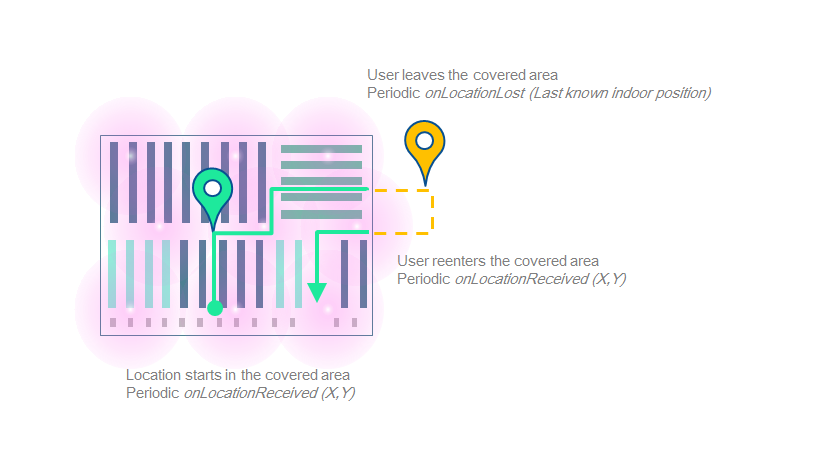
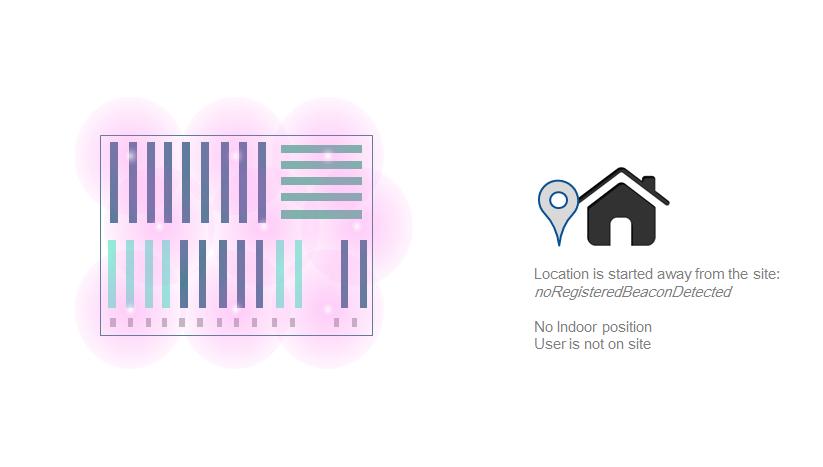
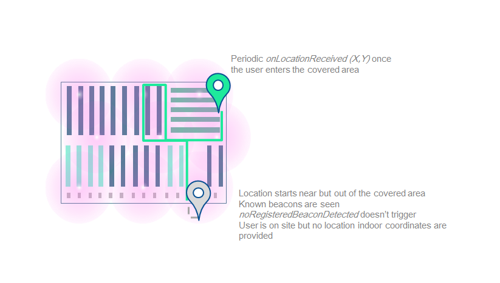

## Location

> **Packages dependencies** If you intend to use this service you have to make sure that the `location` package have been properly downloaded. You can easily check if the package is available on the device with the following method: <a href="http://dev.insiteo.com/api/doc/android/3.4/reference/com/insiteo/lbs/common/auth/entities/ISSite.html#hasPackage(com.insiteo.lbs.common.init.ISEPackageType)" target="_blank">`ISSite#hasPackage(EPackageType.LOCATION);`</a>.


### Location process







### Get your first location

You can use our <a href="http://dev.insiteo.com/api/doc/android/3.4/reference/com/insiteo/lbs/location/ISLocationProvider.html" target="_blank">`ISLocationProvider`</a> to obtain location information. The <a href="http://dev.insiteo.com/api/doc/android/3.4/reference/com/insiteo/lbs/location/ISLocationProvider.html" target="_blank">`ISLocationProvider`</a> needs initialization information in order to communicate with our servers. You can easily link this library to the INSITEO map, so the location can be displayed on it.

To receive location, you will need to start the <a href="http://dev.insiteo.com/api/doc/android/3.4/reference/com/insiteo/lbs/location/ISLocationProvider.html" target="_blank">`ISLocationProvider`</a>, with a <a href="http://dev.insiteo.com/api/doc/android/3.4/reference/com/insiteo/lbs/location/ISILocationListener.html" target="_blank">`ISILocationProvider`</a>:

> **Which flags to use** By default we will use the location flags described in your `AndroidManifest.xml`. Please contact us to get the appropriate location settings and view <a href="http://dev.insiteo.com/api/doc/android/3.4/reference/com/insiteo/lbs/location/ISLocationProvider.html" target="_blank">`ISLocationProvider`</a> for flag details.

```xml
<application>
   <meta-data android:name="com.insiteo.lbs.location.flags" android:value="NAVIGATION_FLAG_BLE"/>
</application>
```

```java
// Start location
ISLocationProvider locProvider = ISLocationProvider.getInstance();

// Add location renderer to the ISMapView, thus location is displayed on map
mapView.addRenderer((LocationRenderer) LocationProvider.getInstance().getRenderer(getResources()));

locProvider.start(listener); 
```

> **Prerequisites**
- The API needs to be initialized.
- You can now be notified when no registered beacons were detected, which probably means that the user started the location whereas he is not on site.

### Available services

Available location-based services are:

- `ISELocationModule.ITINERARY`: this module computes the route between an arrival point, and a departure point (could be the user current location).
- `ISELocationModule.GEOGENCING`: this module detects when user location is in "active" areas, and notify the application that the user entered/stayed in/left these areas.

#### Get a specific LBS module

To use them, you have to request them from <a href="http://dev.insiteo.com/api/doc/android/3.4/reference/com/insiteo/lbs/location/ISLocationProvider.html" target="_blank">`ISLocationProvider`</a> with the <a href="http://dev.insiteo.com/api/doc/android/3.4/reference/com/insiteo/lbs/location/ISELocationModule.html" target="_blank">`ISELocationModule`</a> method. Be aware that a new module is created for each call of <a href="http://dev.insiteo.com/api/doc/android/3.4/reference/com/insiteo/lbs/location/ISLocationProvider.html#getModule(com.insiteo.lbs.location.ISELocationModule)" target="_blank">`LocationProvider#getModule()`</a>.

## Where to go from there?

- [Configure your iBeacons](beacon.md).
- [Compute your first itinerary](itinerary.md).
- [Setup your first geofencing zone](geofence.md).
- [Enable analytics](analytics.md).

## You missed a thing?

- [Project setup](../README.md).
- [Display your first map](map.md).
